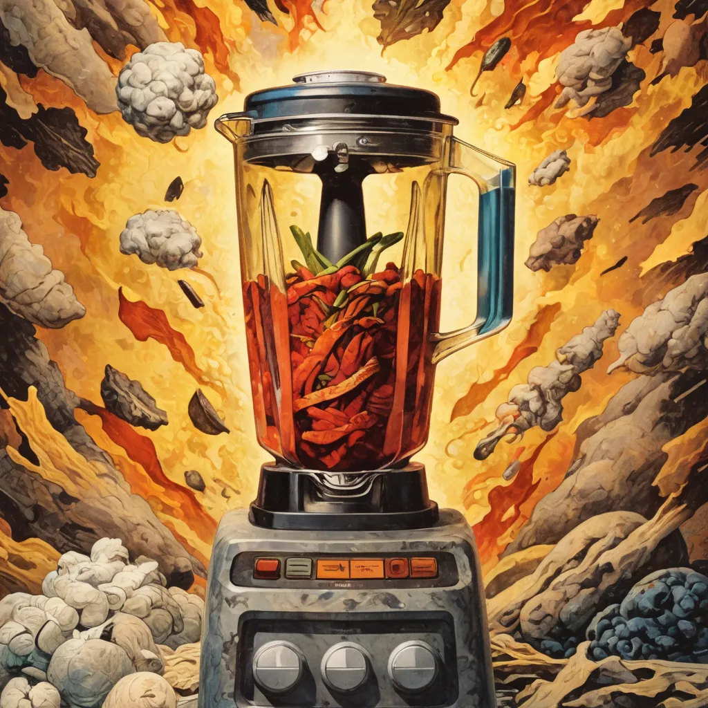
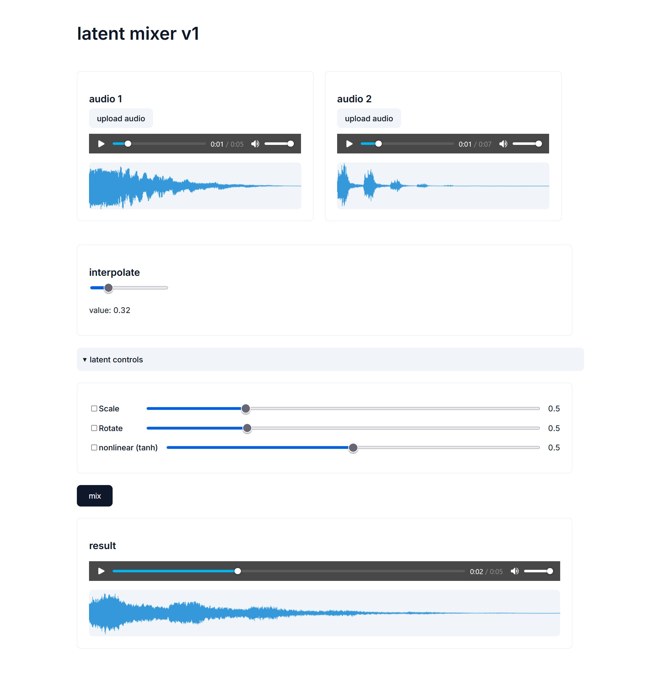

# latent-mixer

This repo is the start of the Max for Live device for the latent-mixer by Aaron Abebe.

---

## Project Overview

The UI is insane right now. An Electron UI is incoming for drag/drop functionality, coherency, and maybe some further manipulation of the output audio.

The folder `latent-mixer` in this repo should be placed in `C:/latent-mixer` unless you want to change the file paths yourself.

### Setup Instructions

1. **Download the Model**:  
   Run the following command to download the model:
   ```sh
   python stuff.py
   ```

2. **Start the Backend**:  
   To get the backend running on port 5000, use:
   ```sh
   python latent_gary_websockets.py
   ```

3. **Ableton Integration**:  
   In Ableton, pull up the `latent-mixer` folder in `Places`. Then, in the `GARY_latent.AMXD` UI, perform the following steps:
   - Press `script npm install`
   - Press `script start`
   - Double-click the `print` object to see the Max console.

   You should see:
   ```
   node.script: Connected to WebSocket server.
   ```
   Then you're good to go.

### How It Works

Both `myBuffer` and `myBuffer2` start recording when you press play in Ableton. I tried real hard to use a 'gate' object so that it would switch between which buffer is recording, and failed so far.

You have to press `write C:/latent-mixer/myBuffer.wav` to write it to file before you send it to the backend anyway.

Re-record the buffers with a second sample and then press `write C:/latent-mixer/myBuffer2.wav`. After that, you're ready to adjust the settings.

The final step is to press `bang`.

Once you see this in the Max console:

```
print: interpolation_complete
```

You then press `replace C:/latent-mixer/outputInterpolated.wav` and you can operate the 0s and 1s for playback.

### Additional Notes

Right now, you gotta place `GARY_latent.AMXD` onto an individual layer, and record the audio it produces into a second layer, like you used to have to do with `gary4live` (if anyone knows what that is).

**Note:** There's probably an easier way to record the audio from the plugin into the Ableton timeline. I'm a big dummy about some things.

You can also use the FastAPI app `main.py` and use a web UI as specified below.

### Final Note

Now that I've started a Max for Live device using a stable-audio backend, I'll probably make another `.AMXD` so that you can call the stable-audio-open model with text prompts and such inside ableton.

This is very much a WIP. as stated above, a simple electron UI can be added so that we can just drag/drop the audio into ableton. 

important: do not try to drag outputInterpolated.wav into the ableton timeline. ableton won't let you rewrite it after you do that.

---

<h1 align="center">
    latent-mixer
</h1>

<p align="center">
  
</p>

<p align="center">
    A sound design tool for creation of experimental music and latent space exploration.
</p>

<p align="center">
    <a 
        href="https://opensource.org/licenses/MIT" 
        target="_blank"
        style="text-decoration: none"
    >
        
    </a>
    <a 
        href="https://twitter.com/mcaaroni" 
        target="_blank"
        style="text-decoration: none"
    >
        
    </a>
</p>

---

### Goals

My main goal for this tool is to provide a **quick and easy** way to mix 2 different samples to generate new and **interesting** sounds.

The tool allows you to interpolate two embeddings by using a weighted average between them. After that, you can sequentially apply different transformations on the embedding (currently scaling, rotating, and a nonlinear transform).

<p align="center">
  
</p>

## Running

### Install Dependencies

```sh
uv venv
source .venv/bin/activate
uv pip install -r requirements.txt
```

### Download and Extract the VAE Checkpoint

Shoutout to Lyra for the recipe ([her post on Twitter](https://twitter.com/_lyraaaa_/status/1804256808900661562)).

```python
from stable_audio_tools import get_pretrained_model
model, model_config = get_pretrained_model("stabilityai/stable-audio-open-1.0")
torch.save({"state_dict": model.pretransform.model.state_dict()}, "vae.ckpt")
```

### Start the Backend

```sh
fastapi dev main.py
```

Open the backend running at [http://localhost:8000](http://localhost:8000).

---

If you find this interesting, please consider:

- Following me on [GitHub](https://github.com/aaronabebe)
- Following me on [Twitter](https://twitter.com/mcaaroni)
